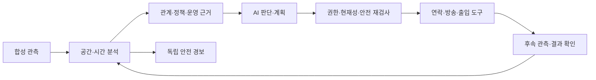

# PARKLINE · 무인 스마트 주차장 AI 관리자

**제4회 경남 AI·SW 경진대회 · 사회문제 해결형 AI Agent**

주차장의 문제를 관측하고, 운영 근거를 확인해 차주 연락·경보·방송·출입 업무를 실행한 뒤 해결 여부를 다시 확인하는 AI 관리자입니다.

이번 제출 구현은 **단일 시설의 로컬 합성 주차장**입니다. 실제 CCTV·차량·차단바·방송 설비를 가상 관측·계정·장치로 대체합니다. AI 판단과 서버의 실행 권한을 분리하고, 차주의 응답만으로 사건을 해결 처리하지 않습니다.



## 주요 기능

| 상황 | 지원 흐름 |
|---|---|
| 통로 차단·출차 방해·주차면 침범 | 관측 → 등록 차주/운영 근거 확인 → 연락·응답 → 합성 이동·재주차 → 지속 공간 회복 확인 |
| 차량·보행자 접근 위험 | 독립 경보와 AI 관리자 보고·후속 확인 |
| 자연어 운영 요청 | 명령 구체화 → 계획 확인 → 구역별 합성 방송 → 입차 제한·출차 유지 → 결과 확인 |
| 역할별 웹 화면 | 실제 데모 로그인·API·SSE, 본인 차량 위치·알림, 사건·명령·실행 이력 |
| 운영 근거 검색 | 승인된 합성 매뉴얼 검색·조건/예외 확인·접근/시행/철회 재검사 |

## 빠른 실행

Windows, 네이티브 Python 3.12, Node.js 24 계열과 npm 기준입니다. API 키 없이 모의 판단과 실제 로컬 서버 연결을 사용할 수 있습니다.

실제 AI를 사용하려면 [OpenAI](https://platform.openai.com/api-keys)와 [Google AI Studio](https://aistudio.google.com/apikey)에서 API 키를 발급받아 Windows 사용자 환경변수 `OPENAI_API_KEY`, `GEMINI_API_KEY`에 각각 등록합니다. 사용할 제공자의 키만 준비하면 되며, 등록 후 새 터미널에서 백엔드를 실행합니다. 실제 모델 실행 명령은 [실행 안내](docs/실행안내.md#실제-모델-선택)를 따릅니다.

저장소 루트 PowerShell:

```powershell
python -m venv .venv
.venv\Scripts\python.exe -m pip install -r requirements.lock.txt
.venv\Scripts\python.exe code/frontend/scripts/run-integration-backend.py
```

별도 PowerShell:

```powershell
cd code/frontend
npm ci
npm run dev:integration
```

`http://127.0.0.1:8000/?mode=live`로 접속합니다. 백엔드는 8010, 프론트는 8000을 사용합니다. `mode=live`는 실제 **백엔드 연결 화면**이며 유료 LLM 자동 호출을 뜻하지 않습니다. `?mode=mock`은 별도 화면 시안입니다.

| 데모 계정 | 역할 |
|---|---|
| `demo-operator` | 시험 회차·환경·업무 제어 |
| `demo-owner` | 시설 소유자·운영 명령 |
| `demo-driver` / `demo-driver-2` | 각각 등록 차량의 차주 |

공개 가상 비밀번호는 `parking-demo-only`입니다. 실제 개인정보나 운영용 인증이 아닙니다. 운영자와 차주를 동시에 보여주려면 서로 다른 브라우저 프로필을 사용합니다.

자세한 회차 생성·Agent 시작·실제 모델 선택·종료 방법은 [실행 안내](docs/실행안내.md), 구현·시험 조건과 한계는 [구현 범위와 검증 결과](docs/구현범위_검증결과.md)를 확인하세요.

## 폴더

| 경로 | 용도 |
|---|---|
| `code/backend`, `code/agent`, `code/simulator` | API·상태·권한·업무 Agent·합성 환경 |
| `code/frontend` | 정식 React 화면, CSS·폰트는 `assets/` |
| `code/devtools` | 시나리오/Agent·가상 장치를 조작하는 개발 콘솔 |
| `code/contracts`, `data/samples` | 공개 데이터 계약·비밀 없는 합성 샘플 |
| `scripts`, `tests` | 실행·재현 도구·평가 정답을 분리한 시험 |

서버 배포·현장 CCTV/YOLO·실장치는 이번 제출 경로에 포함하지 않습니다. 시험 범위와 미검증 조건은 검증 결과 문서에 설명합니다.

## AI 활용과 출처

업무 판단에 OpenAI·Gemini API를, 개발·문서 작성에 Codex/ChatGPT를 활용했습니다. 사용 기술·동봉 폰트의 고지는 [외부 기술·자산 고지](THIRD_PARTY_NOTICES.md)를 따릅니다.
